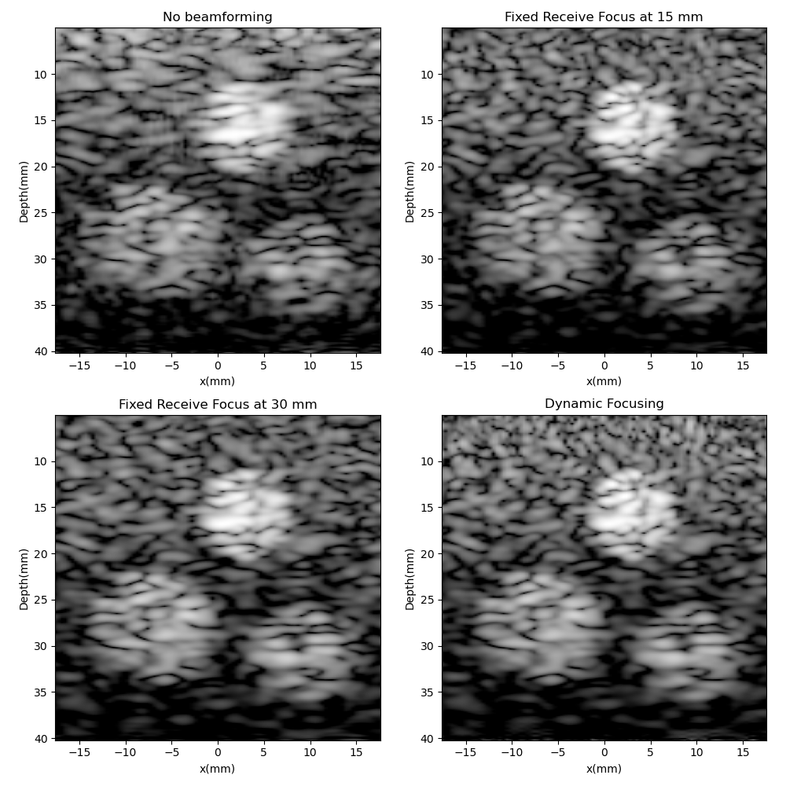
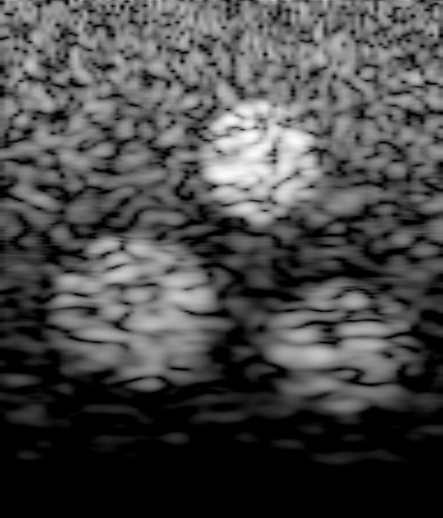

# Intro
This is an example of ultrasound beamforming using a linear array in both Python and Rust. The Python script is written with something of an education emphasis, and the Rust script is a work-in-progress to be refined as Rust's signal and image processing libraries mature.

# Data Description
RF Data was simulated using a 3rd party MATLAB toolbox called K-Wave. Specifically, the data was generated using `example_us_bmode_linear_transducer.m`, which sets up a linear probe and generates the signals received after pulsing into a 3D scattering phantom. The phantom accounts for nonlinearity, multiple scattering, power law acoustic absorption, and a finite beam width in the elevation direction. One can find the nature of the simulated data as well as a description of the K-wave program [here](http://www.k-wave.org/documentation/example_us_bmode_linear_transducer.php).

The aforementioned m-file not only simulates recorded data but performs image reconstruction as well. However, I have merely acquired the raw RF data stored in the variable `sensor_data` and written my own image reconstruction routines. You know, for fun.

# Processing
## Python

The conventional steps in an ultrasound signal processing pipeline are conducted, and a comparison is performed between simple B-mode imaging, beamforming with fixed receive focus, and dynamic focusing:

This program requires `numpy`, `scipy`, `matplotlib`, and `h5py`.

## Rust

The available signal and image processing libraries written in pure Rust are in their infancy at the time of this writing, so this script makes use of existing C++ libraries such as `fftw` and [`opencv`](https://github.com/twistedfall/opencv-rust). The script is centered around [`ndarray`](https://github.com/rust-ndarray/ndarray) and incorporates logging ([`simplelog`](https://github.com/Drakulix/simplelog.rs)) and plot creation/saving ([`plotlib`](https://github.com/milliams/plotlib)) for the checking of intermediate outputs.

Currently a beamformed image is produced albeit without signal filtering and a slow upsampling step.

### Prerequisites

You may be required to install fortran/openblas to compile (e.g. `sudo apt-get install gfortran libopenblas-dev` on debian). Some notes on installing opencv to be compatible with the rust bindings are also included.

Python             |  Rust
:-------------------------:|:-------------------------:
 | 
